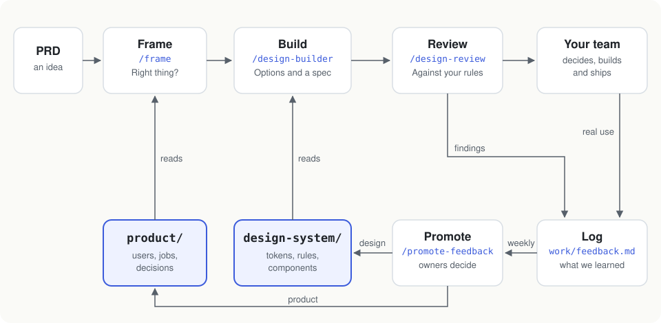

# AI Design Harness

A template repo for teams that design with AI agents (Claude Code or Codex) — with or without a designer, and with or without a design system.

Before anyone writes code, it does two things:

1. **Checks you're building the right thing.** A PRD is matched against your users, the jobs they're trying to get done and the decisions you've already made. If it clashes, it stops there.
2. **Designs it the way your team would.** The agent drafts a few clickable options, recommends one, writes the spec and reviews it against your rules.

What it learns along the way goes back into your product and design notes, so the next round starts from there.



## See it (2 minutes)

Clone the repo and open `examples/support-inbox/proposal.html` in a browser. It's a full run for a made-up support inbox: the framing, three clickable mockups, the recommendation, the spec and the review.


## Try it (15 minutes, nothing to set up)

The repo ships with example content for Helpline, a made-up help desk, so the skills work straight away. Open the repo in Claude Code and type:

| Type | What happens |
|---|---|
| `/frame examples/prd/community-forum.md` | It stops: customer log-ins go against a decision the product already made, and public posts break a privacy constraint. |
| `/frame examples/prd/hand-off.md` | It treats it as a flow of four screens, and asks a product owner to decide first: no job covers the main goal yet. |
| `/design-builder examples/prd/support-inbox.md` | It frames the PRD, asks a few questions, builds three options and reviews its pick. Open the proposal it writes in `work/features/`. |

In Codex, ask for the skill by name: "run frame on examples/prd/hand-off.md".

You need Claude Code or Codex, Node 20 or later, and git.

## Use it on your product

Start with one product and one screen. Install it into your repo with one command. It never overwrites anything; your README and existing files are left alone.

```bash
node path/to/AI-design-harness/scripts/install.mjs path/to/your-repo
```

Then open your repo in Claude Code and run `/bootstrap .`. What it does depends on what you have:

- **You have a design system or a component library.** Bootstrap points `sync.json` at your CSS variables and component folder and drafts the rest. `npm run sync` keeps the harness in step with your code, one way: your code stays the source.
- **You don't.** Bootstrap still drafts a starting point from the colors, type and words your product already uses. You need less than you'd think.

Either way, an owner reads the drafts before anyone relies on them. [Adopting it](docs/adopting.md) has the details.

## Day to day

| When | Who | Run | You get |
|---|---|---|---|
| There's a new idea | Product owner | `/frame path/to/prd.md` | `framing.md`: go, decide first, or stop |
| It's a go | Anyone | `/design-builder path/to/prd.md` | A reviewed proposal for a screen or a flow |
| A screen was made some other way | Anyone | `/design-review path/to/page.html` | `review.md`, plus entries in the log |
| Something comes up in real use | Anyone | Add a row to `work/feedback.md` | An observation in the log |
| Once a week | Owners | `/promote-feedback` | Pull requests against `product/` or `design-system/` |

Skills are saved instructions for the agent. `npm run check` runs on every pull request and catches broken links between all of these.

## What's inside

```
product/            what to build and why: users, jobs, concepts, constraints, decisions
design-system/      how it looks and behaves: tokens, rules, writing, components, layouts
work/features/      one folder per idea: framing, mockups, proposal, review
work/feedback.md    what we've learned, waiting for an owner
.claude/skills/     bootstrap, frame, design-builder, design-review, promote-feedback
scripts/            check, sync, build-tokens
examples/           sample PRDs and a full example run
```

IDs you'll see: `U-` user, `J-` job, `PP-` product principle, `PD-` product decision, `CON-` constraint, `P-` design principle, `R-` design rule, `D-` design decision, `FB-` feedback entry. They're never renumbered.

[How it works](docs/how-it-works.md) explains the ideas behind it, with pictures. There's also a [slide deck](docs/slides/ai-design-harness.pdf); to present it from a browser, open `docs/slides/index.html`.

## Not for

Screens unlike anything your product has today, say your first dashboard: the agent can draft options, but someone with design experience should finish them. It also doesn't write production code. It gets you to a reviewed design; building it is still your job.
