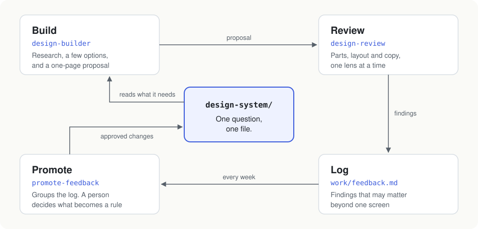
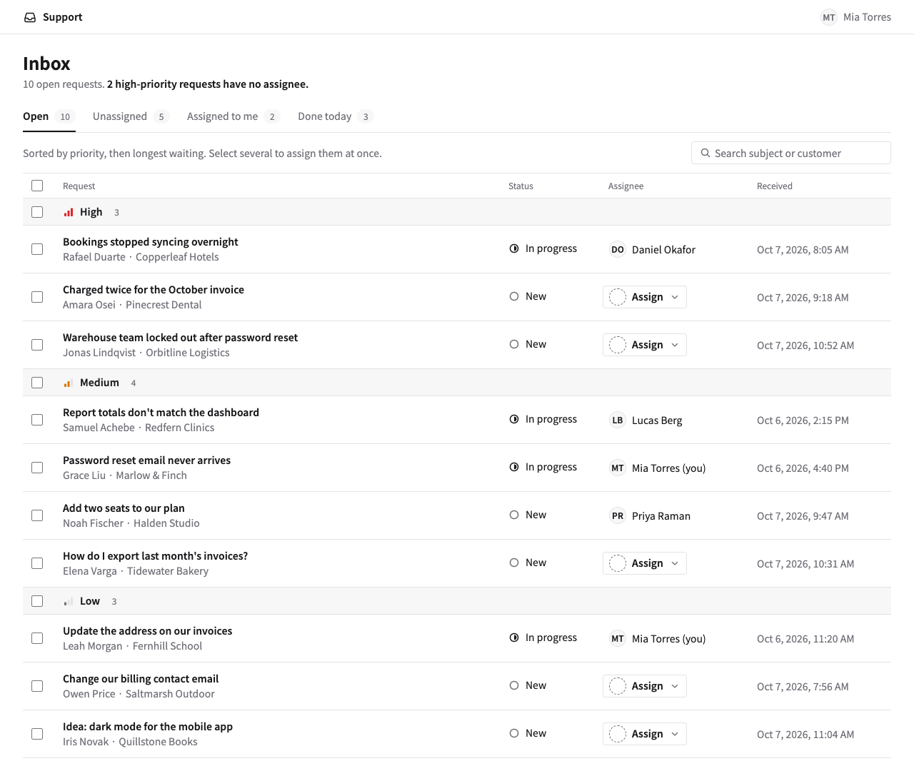

# AI Design Harness

A template repo for teams that design UI with AI agents (Claude Code or Codex), with or without a designer on the team.

You write your design rules down as small files. An agent uses them to draft and review screens. When a review turns up something new, an owner decides whether it goes into the rules.

Together, these files, three skills and one check script are the "harness". They keep the agent inside your rules.

## The three ideas

1. **One question, one file.** "What color is this?", "Which component?", "How do we word errors?" — each has exactly one home.
2. **Build wide, review narrow.** Building explores a few real options. Reviewing checks one area at a time: components, layout, then copy (the UI text).
3. **Feed reviews back.** Findings go into a log. Once a week an owner promotes the ones that matter into the design system, and the next build reads them.

[How it works](docs/how-it-works.md) explains each one, with pictures. There's also a short [slide deck](docs/slides/ai-design-harness.pdf); to present it from a browser, open `docs/slides/index.html`.

## What you get

For each screen, a one-page HTML proposal: research notes, about three clickable mockups, a recommendation with reasons and a spec. Next to it, `review.md` checks the recommendation against your rules. You open the proposal in a browser.

That's one of the three mockups from [a full example run](examples/support-inbox/), for a made-up support inbox.

It doesn't write production code or use your component library. It gets you to a reviewed design; building it is still your job.

## Your first hour

You need Claude Code or Codex, Node 20 or later, and git.

1. **Get the files.** Use this repo as a template for a new repo. Or copy `design-system/`, `work/`, `.claude/skills/`, `.agents/`, `.github/`, `scripts/` and `AGENTS.md` into your product repo, add the two scripts from `package.json`, and if you already have a `CLAUDE.md`, add the line `@AGENTS.md` to it.
2. **Fill in the minimum.** In `design-system/foundations/principles.md`, write who the product is for and your quality bar. In `design-system/tokens/tokens.json`, put your real colors (the values there are placeholders). Run `npm run tokens`. Everything else can stay as `(example)` for now; the agent will tell you when it relied on one.
3. **Write a short PRD** (product requirements doc) for one screen: who uses it, what job they're doing, what's wrong today, what has to be on it. Save it anywhere, e.g. `work/prd/invoice-list.md`.
4. **Run it.** In Claude Code, opened in your repo, type `/design-builder work/prd/invoice-list.md`. It asks up to five questions, builds the options and reviews its own recommendation.
5. **Open** the proposal in a browser, e.g. `work/features/20261007-invoice-list/proposal.html`.

## Setting it up for your team

- Replace the rest of the `(example)` content as you go. Delete `FB-01` in `work/feedback.md` and `D-01` in `design-system/decisions.md` together, or the check will complain.
- Keep the rule IDs `R-01`–`R-05` (reword them freely); the skills and the check refer to them. Add your own from `R-06`.
- Put your team's GitHub usernames in `.github/CODEOWNERS`. These people are the **owners**: they approve every change to `design-system/`. No designer on the team? Pick one owner anyway.
- `npm run check` runs on every pull request. It needs nothing but Node.

## Everyday use

| To | Run | You get |
|---|---|---|
| Design a screen | `/design-builder path/to/prd.md` | A reviewed proposal in `work/features/` |
| Review a screen made some other way | `/design-review path/to/page.html` | `review.md`, plus new entries in the feedback log |
| Turn feedback into rules (weekly) | `/promote-feedback` | A pull request against `design-system/` for an owner to merge |
| Keep an approved screen | Follow [screens/README.md](design-system/screens/README.md) | `design-system/screens/<name>/` |

Skills are saved instructions for the agent. The `/name` form is Claude Code; in Codex, ask for the skill by name.

IDs you'll see: `P-01` principle, `R-01` rule, `D-01` decision, `FB-01` feedback entry. They're never renumbered.

## Already have a design system or a Figma library?

Keep it as the source. Copy its values into `tokens.json` and its rules into the files here, and update them when the source changes. This repo is the version the agent reads. When your team approves a proposal, hand the recommended mockup and its spec to engineering, or rebuild it in Figma if that's where your team works.

## Not for

Screens unlike anything your product has today (say, your first dashboard). The agent can draft options to compare, but someone with design experience should choose and finish them. And if you only need lots of rough ideas fast, one long design-notes file is enough.

## Notes

On Windows, clone with `git clone -c core.symlinks=true <url>` so `.agents/skills` (the Codex copy of the skills) works.

Built on ideas from Canary's [NestUI](https://github.com/SSK-TBD/NestUI) ([article](https://note.com/canary_inc/n/n538adfe8daee)) and Reiwa Travel's [design-builder write-up](https://note.com/toitoi1618/n/ndf35dbd2585b).
