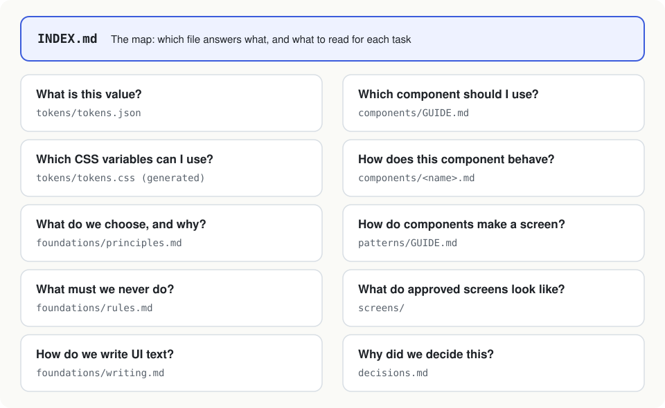
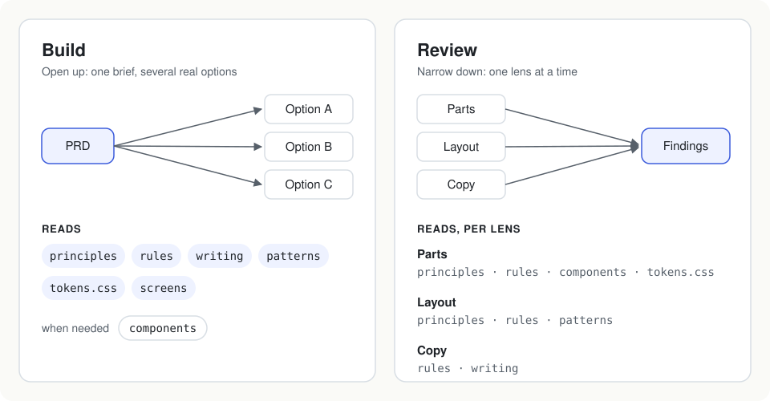
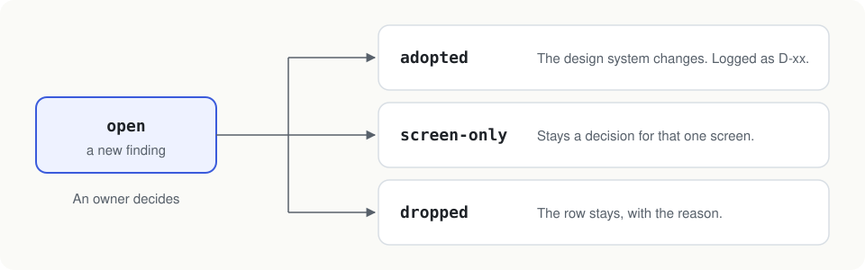

# How it works

## One question, one file

Design guidance tends to pile up in one long document: brand, principles, values, component behavior, layout and one-off screen decisions, all mixed together. It gets repeated, it drifts, and nobody knows which copy is right.

Here every question gets one file, and [INDEX.md](../design-system/INDEX.md) is the map. When something changes there's one place to edit, and the agent opens a short, named list of files for each task instead of everything.

Don't split by length. Split when something is said twice, when you can't name the one place to change it, or when team-wide rules and one-screen decisions are tangled up.

## Build wide, review narrow

Building and reviewing are different jobs, so they read different things. Building pulls in principles, rules, writing, layouts and approved screens, then spreads out into a few real options. Reviewing checks one area at a time — components, layout, copy — and only re-reads the files for that area. Every finding points to a principle or rule ID, so it's not just someone's taste.

The columns in INDEX.md decide who reads what. The skills follow them.

## Feed reviews back

Anything a review turns up that could apply beyond one screen goes into [the feedback log](../work/feedback.md). Every entry starts `open`. Once a week an owner runs `/promote-feedback`, which groups the entries and suggests what to do with each. The owner decides:

- **adopted** — the design system changes, in a pull request, and `decisions.md` gets a row
- **screen-only** — it stays a decision for that one screen
- **dropped** — the row stays, with the reason

The rules for when to promote are in `work/feedback.md`.

## Running it as a team

Owners are the people listed in `.github/CODEOWNERS`.

For the first few months, only owners change `design-system/`. Collect findings in the log and decide in batches until the output feels steady. Then let designers open pull requests too; copy and guidelines are a good place to start.

Once there are two or more owners, turn on branch protection with "Require review from Code Owners". GitHub won't let you approve your own pull request, and some plans don't offer branch protection on private repos. Until then, let your own pull request sit for a day and read the diff again before merging.

If a pull request comment points out something that applies elsewhere, whoever wrote it adds a row to the log.
